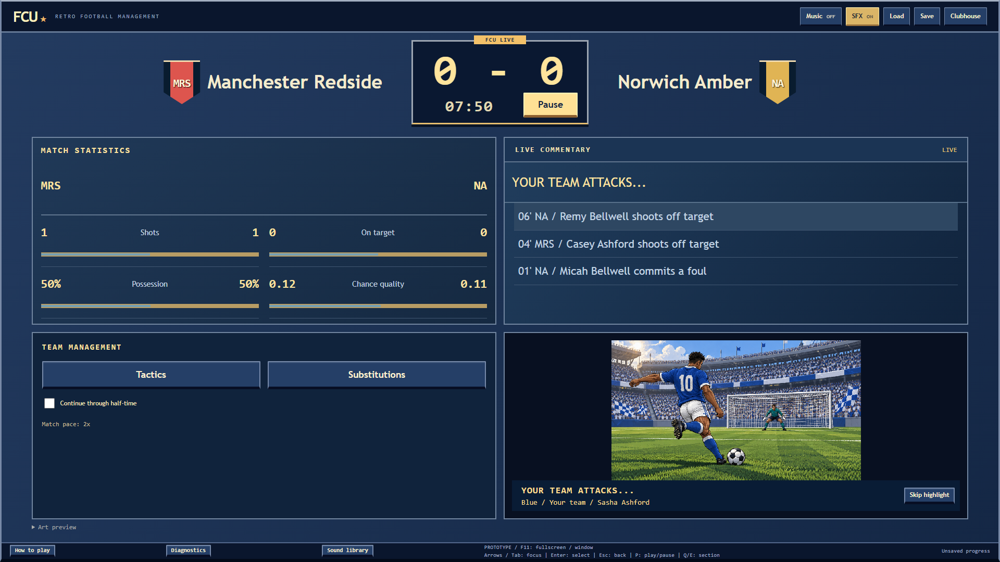

# Football Club Universe (FCU)

An offline football management game with quick decisions, season-long consequences and detailed pixel-art match highlights.

**v0.9.0 development prototype.** Windows source and portable builds have been tested. Native Linux packaging is configured but remains unverified. FCU has not been publicly released on Steam.



## Two ways to build a team

**FCU Career** puts you in charge of a fictional club across England, Spain, France, Italy and Germany. The development world has 176 clubs across ten active divisions, promotion and relegation, domestic cups and continental competition. A smaller eight-club exhibition is also available.

Pick the squad, set tactics and make substitutions. Between fixtures, scout players, buy, sell and loan players, renew contracts and balance the wage bill. Promote academy prospects into senior contracts and review individual player records across seasons. Secondary positions count when selecting the team. Training, condition, morale, injuries and suspensions affect your choices. Develop the academy, improve recovery facilities and manage board expectations as seasons pass.

**FCU Dream Club** is a separate eight-club fantasy league. Complete three fixtures to earn a player-choice pack, choose one player and decide how they fit your active squad. Wins and losses count equally; season completion brings another pack. Watch matches or use Instant result. Dream players, rewards and checkpoints stay separate from Career.

All default clubs and players are fictional. Development builds can import unsigned roster packs for a new career; packaged builds require signed packs. Existing careers keep their frozen roster. Live provider integration has not been verified.

## Match day

The scoreboard, clock and Play/Pause sit above four equal panels: statistics and team management on the left, commentary and highlights on the right. Matches use a fixed 2x pace. Pause to change tactics or make substitutions; changes affect future play. Half-time pauses unless Continue through half-time is enabled.

Offsides stop attacks, goals can be disallowed for offside or an attacking foul, corners can produce follow-up chances, and shots can hit the woodwork. Awarded in-play penalties affect the match score; cup shootouts remain a separate tiebreak.

Original pixel-art still sequences build anticipation, then reveal a goal, save or missed chance. Blue/white represents your side and red/white the opponent. These are illustrations, not continuous player animation or playable action football. Commentary remains available if artwork cannot load. Skip highlight dismisses the illustration without skipping match time. Injuries and dismissals pause for a decision.

Music and SFX have independent settings remembered on this computer. Audio plays at normal speed regardless of match pace. Open Sound library to audition the recordings and read their credits; audio quality is still being refined.

## Run from source

The recorded Windows setup uses Node.js 26.8.2 and npm 12.0.2. Exact dependencies are pinned in the lockfile. Initial setup can require downloads; installed gameplay works offline.

```sh
npm ci
npm run dev
```

To run a production build without the development server:

```sh
npm run build
npm start
```

Use **Squad > Player contracts** for renewals, academy promotion and outgoing listings/bids. **Squad > Player records** shows tracked appearances, goals, assists and cards. Older saves begin recording future matches.

Choose **Start a career**, select a club and seed, then **Begin career**. Open **Squad**, pick eleven players and confirm the lineup. Return to **Clubhouse**, advance to match day, choose **Kick off**, then **Play**. **How to play** in the footer explains both modes, squad decisions, saves and controls.

## Controls

FCU starts fullscreen. **F11** switches between fullscreen and window mode.

| Action | Keyboard | Standard gamepad |
| --- | --- | --- |
| Move focus | Arrows / Tab | D-pad / left stick |
| Confirm | Enter | Bottom face button |
| Back | Escape | Right face button |
| Play / Pause | P | Start |
| Change section | Q / E | Shoulder buttons |

Gamepad confirm opens an offline keyboard or chooser for supported fields. Physical controllers, Steam Input and Steam Deck still need verification.

## Saves and recovery

Save creates a new checkpoint, including during a match. Completed Career rounds and mandatory Dream rewards save automatically. Returning to the title or closing FCU requests a final checkpoint. If saving fails, retry or return to the game; Quit without saving loses only progress after your last confirmed checkpoint.

Load shows earlier checkpoints and alternate continuations in pages of 20. Choosing one preserves the others. Older supported saves migrate when loaded; original files remain untouched. A new save uses Career schema 25 or Dream envelope 5, with app 0.9.0 and engine 0.7.5. Older builds cannot read these newer formats.

Saves live outside the installation folder:

- Windows Career: `%APPDATA%\fcu\saves`
- Windows Dream: `%APPDATA%\fcu\dream-saves`
- Linux: normally `~/.config/fcu/saves` and `~/.config/fcu/dream-saves`

Screen errors offer recovery to the title and confirmed checkpoints. If the renderer process stops, a native prompt offers Return to title or Quit. Unsaved progress may be lost. Suspend pauses the match and attempts a checkpoint; hardware sleep can interrupt that write, and resuming leaves play paused.

Diagnostics in the footer exports a local technical report with build identity, timings and coarse error codes. It excludes saves, player names, file paths and credentials. Nothing is uploaded.

## Build a portable folder

After installing dependencies and building, run the matching command on its native OS:

```sh
# Windows
npm run package:win
# Linux (configured; not yet verified)
npm run package:linux
```

Then run `npm run start:packaged`. Packaging prints a unique `release/build-*` folder containing `Football Club Universe.exe` on Windows or `fcu` on Linux. Keep the entire folder together. The package includes an FCU icon, file checksum manifest and dependency/audio notices. Stale build inputs are rejected; rebuild after source changes.

These are unsigned local prototypes, not published installers.

## Development checks

```sh
npm run typecheck
npm run lint
npm test
npm run build
npm run test:e2e
npm run check:docs
```

The current inventory is 102 unit/integration cases and four Electron journeys. Typechecking uses TypeScript 7.0.2; ESLint uses Microsoft's separate TypeScript 6 compatibility API. Audit reporting remains enabled; an audit with no known advisories is not a guarantee against all vulnerabilities.

Run the fixed match, maintained Career and Dream validation workloads with `npm run validate:balance`. The JSON report at `work/validation/latest.json` records the source revision, platform, metrics and failures. Individual workloads are `npm run probe`, `npm run validate:career` and `npm run validate:dream`. These check progression and balance signals; they cannot establish enjoyment.

## Current limits

- Player and economic balance are provisional and need broader playtesting.
- All checkpoints are retained; automatic pruning is not implemented.
- Native Linux, low-end hardware, physical controllers and Steam Deck remain unverified.
- Steam integration and publication are incomplete. No compatibility badge is claimed.
- New match events use commentary where dedicated illustrations are still pending.

FCU is an independent project and does not claim affiliation with existing football games, clubs or leagues.

## Development audio

All nine active sounds are in assets/audio. Replace a WAV with the same filename, then restart npm run dev. Rebuild to update a packaged game; replacing source files does not modify an existing portable build. Normal development and builds do not regenerate or overwrite these files.

| File | Used for |
| --- | --- |
| music.wav | Looping menu music (Music toggle) |
| click.wav | Menu button clicks (SFX toggle) |
| kick.wav | Approved original ball kick |
| cheer.wav | Goal celebration; owner-supplied Cheer.wav |
| groan.wav | Saved/missed shots, woodwork and missed penalties; owner-supplied Missed.wav |
| crowd.wav | Looping stadium ambience |
| whistle.wav | Short kickoff/restart and half-time whistle (0.55 seconds) |
| tackle.wav | Brief foul/decision whistle (0.18 seconds), replacing the tackle sound |
| fulltime.wav | Two short blasts then a longer blast at full time (1.43 seconds) |

Music and clicks were previously generated at runtime; they are now editable WAVs of the original tune and button note. Original synthesis sources and rejected crowd auditions remain in assets/original/audio; these are not live game inputs. All active sounds can be auditioned in Sound library. Source/credit metadata is in apps/game/src/renderer/audioAssets.ts; preparation records are in assets/audio/edits.json. If a replacement comes from another source, update its metadata too.

## Sound credits

Kick, music and menu click are original FCU synthesis. Cheer.wav and Missed.wav were supplied by the owner and copied unchanged; author/source attribution was not supplied. The remaining recordings are edited excerpts with level adjustment and edge fades; Freesound inputs used publicly served HQ MP3 previews. Credits also appear in the game and packaged notices.

- Whistle: [referee-whistle.wav](https://freesound.org/people/Pablo-F/sounds/90743/), Pablo-F, CC BY 3.0.
- Foul and full-time whistles: edits of the same Pablo-F referee recording, CC BY 3.0. The preserved source is assets/original/audio/referee-whistle-source.wav; scripts/create-whistle-cues.mjs records the cuts and gaps.
- Stadium ambience: [noise#01.aif](https://freesound.org/people/huubjeroen/sounds/39733/), huubjeroen, CC0 1.0.
